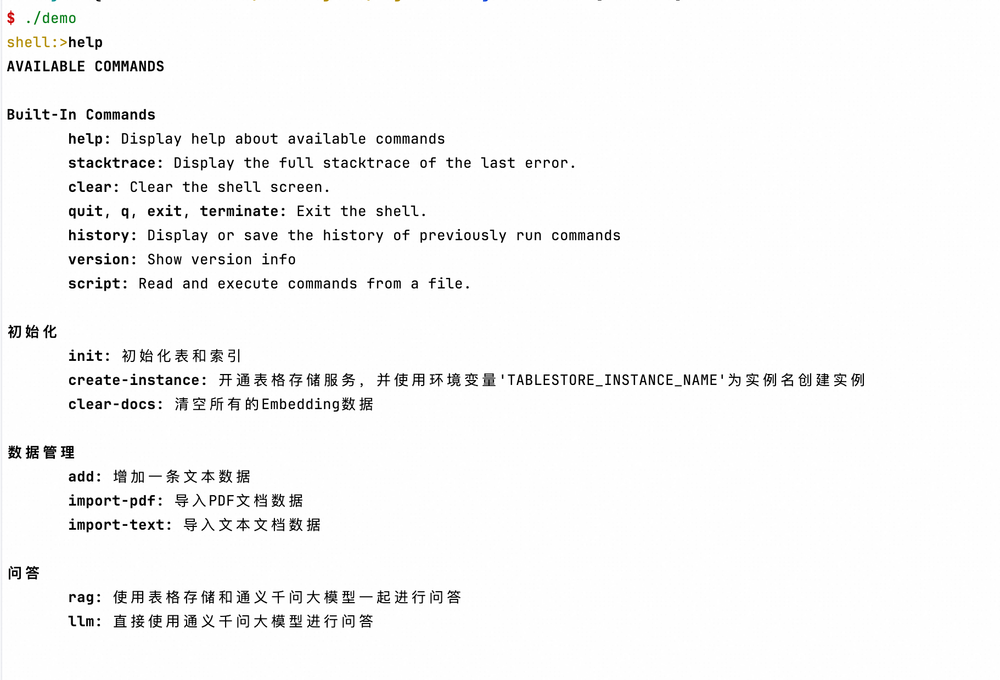

# JDK 依赖
Java 21

# Build 打包

```shell
 ./gradlew assemble
```

# 启动

#### 设置环境变量
```shell

export DASHSCOPE_API_KEY=xxx
export TABLESTORE_ACCESS_KEY_ID=xxx
export TABLESTORE_ACCESS_KEY_SECRET=xxx
export TABLESTORE_ENDPOINT=xxx
export TABLESTORE_INSTANCE_NAME=xxx
export TABLESTORE_REGION=cn-hangzhou
```
#### 启动Demo
```shell
./demo
```

#### 输入提示

Type `help`.



#### rag 与 llm 对比测试


