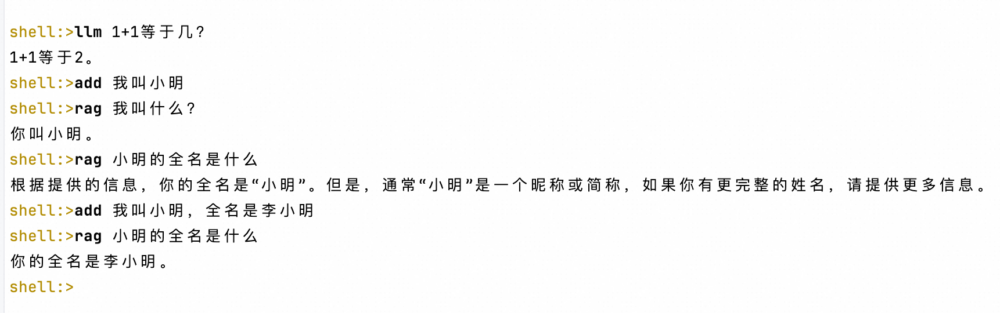

# JDK 依赖
Java 21

# Build 打包

```shell
 ./gradlew assemble
```

# 启动

#### 1. 设置环境变量
```shell

export DASHSCOPE_API_KEY=xxx
export TABLESTORE_ACCESS_KEY_ID=xxx
export TABLESTORE_ACCESS_KEY_SECRET=xxx
export TABLESTORE_ENDPOINT=xxx
export TABLESTORE_INSTANCE_NAME=xxx
export TABLESTORE_REGION=cn-hangzhou
```
#### 2. 启动Demo
```shell
./demo
```

#### 3. 输入提示

Type `help`.


#### 4. 初始化表和索引

输入 `init` 即可。

#### 5. 导入数据

通过以下方式即可完成数据的导入。
 - 导入PDF文件: `import-pdf   xxxx.pdf` 
 - 导入文本文件: `import-text  xxx.txt`
 - 导入单行数据: `add "一段文本"`

#### 6. rag 与 llm 对比测试


